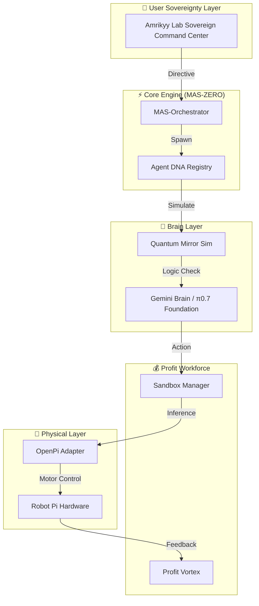

<div align="center">

<!-- Visual Header -->
<svg width="800" height="280" viewBox="0 0 800 280" xmlns="http://www.w3.org/2000/svg">
  <defs>
    <radialGradient id="piGrad" cx="50%" cy="50%" r="50%">
      <stop offset="0%" stop-color="#39FF14" stop-opacity="0.8"/>
      <stop offset="100%" stop-color="#008080" stop-opacity="0.2"/>
    </radialGradient>
    <filter id="glow">
      <feGaussianBlur stdDeviation="3.5" result="coloredBlur"/>
      <feMerge>
        <feMergeNode in="coloredBlur"/>
        <feMergeNode in="SourceGraphic"/>
      </feMerge>
    </filter>
  </defs>
  
  <!-- Background Grid -->
  <pattern id="grid" width="40" height="40" patternUnits="userSpaceOnUse">
    <path d="M 40 0 L 0 0 0 40" fill="none" stroke="#333" stroke-width="0.5"/>
  </pattern>
  <rect width="800" height="280" fill="url(#grid)" rx="12"/>

  <!-- Orbiting rings -->
  <g class="ring" opacity="0.3">
    <ellipse cx="400" cy="140" rx="120" ry="40" fill="none" stroke="#39FF14" stroke-width="1"/>
  </g>
  <g class="ring" opacity="0.2" style="animation-direction: reverse; animation-duration: 15s;">
    <ellipse cx="400" cy="140" rx="160" ry="60" fill="none" stroke="#008080" stroke-width="0.5"/>
  </g>

  <!-- Central Orb (MAS-ZERO Core) -->
  <g class="orb">
    <circle cx="400" cy="140" r="45" fill="url(#piGrad)" filter="url(#glow)" opacity="0.9"/>
    <circle cx="400" cy="140" r="35" fill="none" stroke="#fff" stroke-width="1" opacity="0.4"/>
    <text x="400" y="148" text-anchor="middle" fill="#39FF14" font-size="28" font-weight="bold" filter="url(#glow)">π</text>
  </g>

  <!-- Orbiting dots -->
  <circle cx="280" cy="140" r="4" fill="#39FF14" class="dot" style="animation-delay: 0s"/>
  <circle cx="520" cy="140" r="4" fill="#008080" class="dot" style="animation-delay: 0.5s"/>
  <circle cx="400" cy="80" r="3" fill="#39FF14" class="dot" style="animation-delay: 1s"/>
  <circle cx="400" cy="200" r="3" fill="#008080" class="dot" style="animation-delay: 1.5s"/>

  <!-- Title -->

<text x="400" y="245" text-anchor="middle" fill="#fff" font-size="32" class="title" letter-spacing="2">PIWORKER-OS</text>
<text x="400" y="265" text-anchor="middle" fill="#39FF14" font-size="12" class="subtitle" letter-spacing="4">SOVEREIGN AGENT ECONOMY // PHYSICAL INTELLIGENCE</text>
</svg>

<div align="center">
  
</div>

<!-- Badges -->
<p>
  
  
  
  
  
</p>

<h3>
  <span>🧠</span> وكلاء ذكاء اصطناعي ذاتيون يولدون الدخل ويديرون الروبوتات الفيزيائية
  <br/>
  <em>Self-Evolving AI Agents That Print Money & Control Pi-Robots</em>
</h3>

<p>
  <a href="#-quick-start">بداية سريعة / Quick Start</a> •
  <a href="#-tech-stack">التقنيات / Tech Stack</a> •
  <a href="#-architecture">المعمارية / Architecture</a> •
  <a href="#-project-structure">الهيكلية / Structure</a> •
  <a href="#-verification-pipeline">التحقق / Verification</a> •
  <a href="https://github.com/Moeabdelaziz007">Community</a>
</p>

</div>

---

## 🎬 ماهو PiWorker؟ / What is PiWorker?

**PiWorker-OS** هو أول **نظام تشغيل للوكلاء السياديين** — منظومة ذاتية التطور من وكلاء الذكاء الاصطناعي الذين يكتشفون الفرص، ويبنون المنتجات، وينشرونها، ويولدون الأرباح دون تدخل بشري.

يجمع النظام بين التفكير العصبي عالي المستوى (العقول) والتنفيذ المادي منخفض المستوى (الأجساد) من خلال دمج **Google Gemini** وبروتوكول **π0.7 (OpenPI)** للروبوتات.

**English:** **PiWorker-OS** is the first **Sovereign Agent Operating System** — a self-evolving ecosystem of AI agents that discover opportunities, build products, deploy them, and generate revenue with zero human intervention.

It bridges high-level Neural Reasoning (Brains) with low-level Physical Execution (Bodies) by integrating Google Gemini and Physical Intelligence’s π0.7 (OpenPI).

---

## 🛠️ التقنيات المستخدمة / Tech Stack

- **الواجهة والتنسيق (Frontend/Orchestration)**: TypeScript, [Next.js 15](https://nextjs.org/), [React 19](https://react.dev/), Tailwind CSS.
- **محرك السيادة (Sovereign Engine)**: [Go](https://go.dev/) (v1.25+), gRPC, Protobuf.
- **نماذج الذكاء الاصطناعي (AI Models)**: Google [Gemini 1.5 & 2.0 Flash](https://aistudio.google.com/) (Free Tier Optimized).
- **الروبوتات (Robotics)**: OpenPI (π0.7), Robot Pi, ROS.
- **الهوية والمالية (Identity/Finance)**: DID (`did:piworker`), Pi Network SDK (Auth/Payments), Stellar/Soroban.
- **قاعدة البيانات (Persistence)**: Upstash Redis, Neural Memory Mesh (JSONL).

---

## 🏛️ المعمارية (MAS-ZERO Core) / Architecture



---

## 📂 هيكلية المشروع / Project Structure

- `agents/`: تعريفات DNA الوكلاء والسمات البيولوجية الاقتصادية. / Agent DNA and biological-economic trait definitions.
- `api/`: نقاط نهاية API ومعالجات Go المتوافقة مع Vercel. / API endpoints and Vercel-compatible Go handlers.
- `app/`: واجهة Next.js 15 (لوحة التحكم، السوق، المبنى). / Next.js 15 App Router interface.
- `cmd/piworker/`: نقطة الدخول لمحرك Go السيادي. / Entry point for the Go Sovereign Engine.
- `core/`: منطق "الدماغ" الأساسي (الحوكمة، التطور، المالية). / Core "Brain" logic (Governance, Evolution, Finance).
- `infra/`: تكوينات البنية التحتية، الشهادات، وتنسيق Docker. / Infrastructure configurations and Docker orchestration.
- `plugins/`: إضافات الوكلاء المستقلة (كاشطات الجوائز، MEV). / Autonomous agent plugins.
- `sidecar/`: طبقة "العضلات" — محرك Go (المالية، الجسر). / The "Muscle" layer — Go Sovereign Engine.
- `sandbox/`: بيئة تنفيذ معزولة عصبياً (Ring 3). / Neural-Isolated execution environment.
- `tests/`: مجموعة اختبارات من 4 طبقات بما في ذلك Playwright. / 4-tier verification suite.
- `scripts/`: نصائح برمجية متقدمة لتنسيق التطوير. / Advanced utility scripts.
- `docs/`: التوثيق التقني والخطط الرئيسية. / Technical documentation and master plans.
- `public/`: الأصول العامة والعلامة التجارية. / Public assets and branding.
- `src/`: كود المصدر الإضافي والمكونات المشتركة. / Additional source code and shared components.
- `scratch/`: ملفات مسودة للتجارب السريعة. / Scratchpad for quick experiments.

---

## 🚀 البداية السريعة / Quick Start

### 1. استنساخ المستودع / Clone

```bash
git clone https://github.com/Moeabdelaziz007/PiWorker-OS.git
cd PiWorker-OS
```

### 2. إعداد البيئة / Configure

انسخ ملف البيئة التجريبي وقم بتعبئة أسرارك:
Copy the example environment file and fill in your secrets:

```bash
cp .env.example .env
```

**المتغيرات الأساسية / Essential Variables:**

- `GEMINI_API_KEY`: مفتاح Google AI Studio.
- `PI_NETWORK_API_KEY`: مفتاح شبكة Pi.
- `SOVEREIGN_AUTH_TOKEN`: رمز المصادقة للمحرك.

### 3. تثبيت الاعتمادات / Install

```bash
npm install
go mod download
```

### 4. التشغيل / Launch

```bash
npm run dev:stack
```

---

## 🛡️ الركائز السبع / The Seven Pillars

1. **الثلاثي الذهبي (Golden Trio)**: الرئيس التنفيذي، المنفذ، الناقد.
2. **التطور الجيني (Genetic Evolution)**: طفرات DNA بناءً على عائد الاستثمار.
3. **الإجماع الكمي (Quantum Consensus)**: محاكاة 30+ شخصية متوازية.
4. **دوامة الربح (Profit Vortex)**: الافتراس المالي الذاتي.
5. **أمان بوابة الصلب (Steel Gate)**: التشفير Ed25519.
6. **البروتوكول الفيزيائي (Physical Protocol)**: تكامل π0.7 VLA.
7. **شبكة الذاكرة العصبية (Neural Memory Mesh)**: طبقة الخبرة المستمرة.

---

## ✅ خط التحقق / Verification Pipeline

نستخدم نظام تحقق من 4 طبقات لضمان جودة كل إصدار:
We use a 4-tier quality gate to validate each release:

1. **الطبقة 1 (التحليل الساكن):** Typecheck & Lint.
2. **الطبقة 2 (اختبارات الوحدة):** Unit Testing.
3. **الطبقة 3 (التكامل):** Bridge Handshake.
4. **الطبقة 4 (E2E):** Playwright Sandbox Audits.

---

## 📄 الترخيص / License

هذا المشروع مرخص تحت رخصة **MIT**. / Licensed under **MIT License**.

---

<div align="center">
  
  <br/>
  <h3>Moeabdelaziz007</h3>
  <p><em>Lead Architect of Amrikyy Lab & Sovereign Governance</em></p>
  <p><strong>الهدف: بناء نظام تشغيل على بلوكشين Pi يربط العقل بالجسد.</strong></p>
  <p><em>Goal: Building an OS on Pi Blockchain that connects the Mind to the Body.</em></p>
</div>
